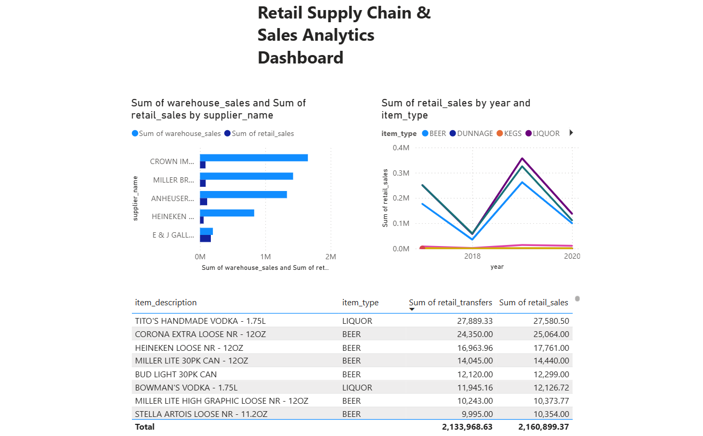

# End-to-End Retail Data Pipeline & Analytics Warehouse

An automated, enterprise-grade data engineering and analytics project that builds a robust Data Warehouse from raw retail transactional data, engineered to solve real-world business challenges.

---

## 🚀 Project Overview
This project automates the extraction, transformation, loading (ETL), and dimensional modeling of a massive retail dataset containing **307,645 rows** of historical warehouse transfers and retail sales. 

The architecture transitions data from a flat monolithic state into a highly optimized **Star Schema Data Warehouse** hosted on PostgreSQL, enabling complex analytic queries to execute instantly.

### Key Technologies Used:
* **Programming:** Python 3.x (Modular Automation)
* **Database:** PostgreSQL (Data Warehousing)
* **Database Client:** DBeaver
* **Version Control:** Git & GitHub
* **Advanced Analytics:** Advanced SQL (CTEs, Window Functions, Aggregate Having clauses)
* **Business Intelligence:** Power BI (Interactive Dashboard Reporting)

---

## 📊 BI Dashboard Preview



*This dashboard connects directly to a local PostgreSQL Data Warehouse to provide an end-to-end executive summary, spanning supplier performance analysis, annual product category trends, and logistics inventory anomaly audits.*

---

## 🏗️ Architecture & Dimensional Modeling

### 1. Project Directory Structure
The pipeline follows a strict modular design pattern to separate concerns and ensure maintainability:

```text
retail_data_pipeline/
│
├── config/                  # Database connections & environment configurations
├── data/
│   └── landing_zone/        # Raw CSV storage (git-ignored)
├── logs/                    # Pipeline execution history logs (git-ignored)
├── src/                     # Core ETL Pipeline engine modules
│   ├── extract.py
│   ├── transform.py
│   └── load.py
├── sql/                     # Advanced Analytics & Business Query scripts
│   ├── top_suppliers.sql
│   ├── top_item_types.sql
│   └── dead_stock.sql
├── main.py                  # Single orchestration entry-point script
├── retail_data_pipeline_dashboard.pbix  # Raw Power BI dashboard file
├── dashboard_preview.png    # Dashboard image preview for documentation
├── .gitignore               # Security & storage guardrails
└── README.md                # Documentation & Business Insights

---
## 👤 Author & Contact

**Developed by Farris Aryanta Loudy Prasetya**
* **Role:** Data Engineer & Analyst
* **Background:** Experienced in end-to-end data pipelines, ETL validation (Medallion Architecture), web scraping automation, and cloud/database environments (AWS, PostgreSQL).
* **Connect with me:** 
  * 📧 Email: faryanta18@gmail.com
  * 💼 LinkedIn: [linkedin.com/in/farrisaryanta](https://linkedin.com/in/farrisaryanta)
  * 🐙 GitHub: [github.com/farrisaryanta](https://github.com/farrisaryanta)